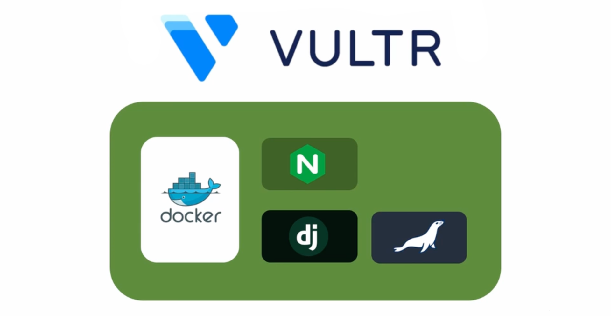
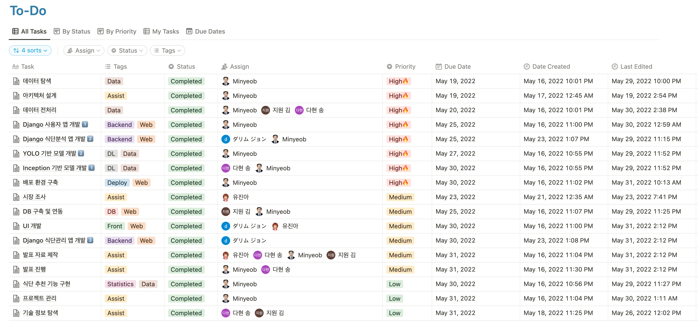
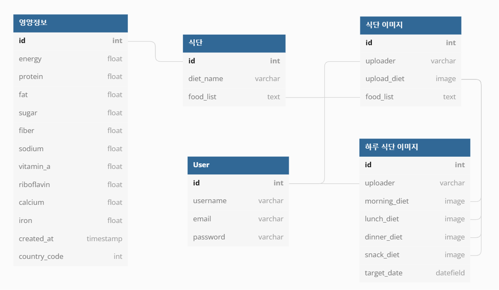
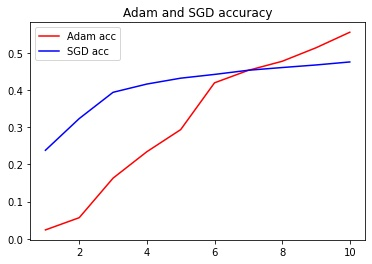
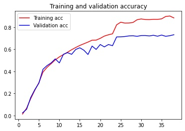
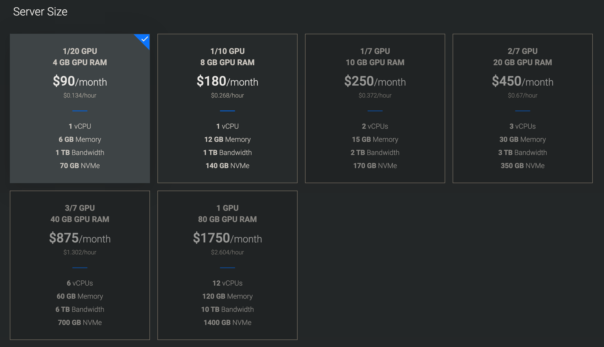
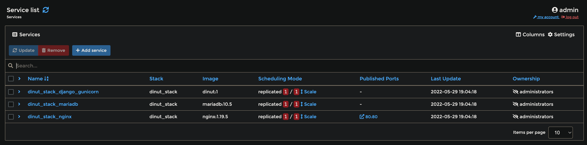
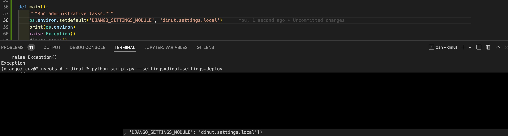
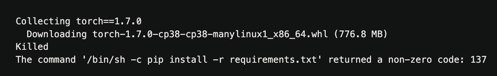
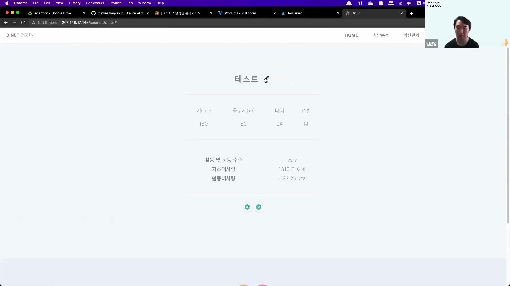

# Dinut
1. [Introduction](#1-introduction)
2. [Tech Stack](#2-tech-stack)
3. [Tasks](#3-tasks)
4. [Issues](#4-issues)
5. [Post-Project](#5-post-project)
6. [Demonstration](#6-demonstration)

---

## 1. Introduction
- 전통적인 식단 관리 서비스는 사용자가 직접 식품명과 영양소를 입력하는 방식이지만,   
이미지 소통이 주류가 되는 사회적 흐름에 맞춰 식단 관리도 이미지 기반으로 동작할 필요가 있음
- 또한, 이미지 기반의 접근방식은 영양 지식에 문외한이지만 건강을 챙기고 싶은 소비자들에게도   
쉽고 간단하게 식단을 관리할 수 있는 경험을 제공할 것
- 식단 이미지 상에서 음식을 검출하고 영양 분석 결과를 시각화하는 식단 분석 기능과   
캘린더에 일일 식단 이미지를 기록하는 식단 관리 기능을 구현해 서비스에 적용
- 음식 검출을 위해 YOLOv5 모델을, 음식 분류를 위해 InceptionV3 모델을 활용
- Vultr에서 제공하는 가상 인스턴스 상에서 Docker를 활용해 딥러닝 모델이 포함된 서비스를 배포

 

---

## 2. Tech Stack

### Languages:
- Python 3.8.9

### IDE:
- Visual Studio Code
- Jupyter Notebook
- Google Colab

### Frameworks & Libraries:
- Django 3.2
- PyTorch 1.11.0
- TensorFlow 2.8.0
- OpenCV 4.5.5
- FusionCharts 3.18.0

### Server & DB:
- Ubuntu Server 22.04 LTS (Vultr)
- Docker 20.10.16 (latest)
- Nginx 1.19.5
- MariabDB 10.5
- Portainer CE 2.11.1

 

---

## 3. Tasks

🔑 **Project Management**

- Notion을 활용한 프로젝트 기획 및 Git Flow에 기반한 프로젝트 관리
- 웹과 DB의 구조를 설계하고, 기능별 브랜치를 생성하여 프로젝트 방향성 제시
- 팀원들의 코드를 리뷰하고, Git Merge 과정에서 발생한 충돌을 해결
- 팀원들의 개인사정과 의견을 반영하여 작업 별로 인원 할당

> **원활한 역할 수행을 위해 정리한 Notion 테이블**

> **DB 구상도 (식단 관련 테이블은 영양정보 테이블을 상속)**

🤖 **Model Engineering**

- `os`와 `shutil` 라이브러리를 활용해 이미지 데이터 폴더 구조 및 라벨 정보 전처리
- YOLO 모델 학습에 대한 기술 정보 탐색 및 YOLOv5 모델에 한식 이미지 학습 시도
- InceptionV3 모델에 SGD, Adam과 같은 다양한 옵티마이저를 적용하여 학습 시도

> **InceptionV3 옵티마이저 비교 (좌) | Adam을 적용시킨 후 정확도 측정 (우)**

<table align="center" style="border:hidden!important;">
<tr>
  <td>
    
  </td>
  <td>
    
  </td>
</tr>
</table>

🌐 **Web Development**

- Django 프레임워크의 클래스 기반 뷰를 활용해 로그인/회원가입 및 프로필 페이지 구현
- DB 상에서 예측된 식품 목록에 대한 영양 정보를 검색, FusionCharts를 활용해 웹 상에서 시각화
- 데이터프레임 정렬을 응용한 유사 식단 추천 기능을 구현하고, 상위 목록을 웹 상에서 테이블로 표시
- AWS와 Vultr 인스턴스 상에서 배포 환경 구축 및 Docker를 활용한 서비스 배포

> **메인 페이지 (하위 페이지에 대한 상세 이미지는 [하단](#6-demonstration) 참고)**

> **Vultr 인스턴스 선택**

> **Docker Stack 배포**

---

## 4. Issues

🤖 InceptionV3 학습 중 truncated image에 대한 에러로 인해 학습 도중 중지되는 문제 발생
> 🔧 `Pillow` 라이브러리로 이미지를 변환하는 과정에서 `LOAD_TRUNCATED_IMAGES` 에러가   
> 발생하는 경우를 파악해 해당하는 68개 이미지들을 전부 제거

🤖 단일 이미지의 분류를 예측하기 위해 모델에 입력 시 shape이 맞지 않는 문제 발생
> 🔧 `ImageDataGenerator`로 변환된 학습 이미지와 예측 모델에 넣으려는 이미지의 차원이   
> 다른 것을 인지하고 해당 이미지에 `NumPy`의 `expand_dims()` 함수를 적용

🌐 배포 환경에 대한 `settings.py`를 적용하여 Django 동작 테스트를 하는 과정에서
`runserver` 이전에 실행되도록 의도한 파일에 로컬 환경에 대한 설정이 적용되는 문제 발생
> 🔧 아래 이미지처럼 `--settings` 파라미터 값이 환경 변수에 적용되지 않는 것을 파악하고   
> 해당 파라미터를 직접 읽어서 환경 변수에 `DJANGO_SETTINGS_MODULE` 키값으로 추가

🌐 Docker 이미지 생성 중 `PyTorch`를 설치하는 과정에서 프로세스가 정지되는 문제 발생
> 🔧 PyTorch와 의존성을 모두 설치하는데 Docker 컨테이너의 메모리가 부족해 발생한 것임을   
> 인지하고 `pip install` 명령어에 `-no-cache-dir` 옵션을 추가

🌐 AWS 인스턴스에서 서버를 실행하는 과정에서 YOLOv5 모델을 불러오다가 멈추는 문제 발생
> 🔧 AWS 프리티어 인스턴스의 성능 한계(1GB RAM) 때문에 발생한 문제임을 깨닫고   
> 상위 스펙에 비교적 저렴한 Vultr 인스턴스(6GB RAM, 1/20 GPU)로 전환

🌐 Django에서 Nginx의 static 파일 경로를 인식하지 못하는 문제 발생
> 🔧 `nginx.conf`의 static 폴더에 대한 alias를 `…/static`에서 `…/static/`으로 변경

---

## 5. Post-Project

- InceptionV3 모델을 Accuracy 기준으로 학습하는 과정에서 예측 결과가 특정 분류에 집중되었는데,   
이후 F1-Score를 기준으로 재학습을 시도해보지 못하고 프로젝트가 마무리되어 아쉬움이 있음
- 타임아웃이 있는 Colab 환경에서 계정을 번갈아가며 이미지 데이터를 압축해제하고 조금씩 학습시키는데   
굉장한 불편함을 느껴 딥러닝 학습 시 자체적인 워크스테이션의 필요성을 절실히 느낌
- 웹에서 다양한 분석 그래프를 보여줬으면 좋았겠지만, CSS 스타일을 적용하는 것조차 버거워서   
시각적으로 뛰어난 결과물을 보여줄 수 없었던 것이 아쉬움
- 서비스의 기능적인 부분이 완성되어도 UI가 아름답지 않으면 무언가 부족하다는 것을 인식하면서   
프론트엔드 부분의 중요성을 느낌
- 이미지 드래그, 캘린더 등의 웹 기능들이 자바스크립트 기반으로 만들어지는 것을 보면서   
웹 개발에 있어서 자바스크립트에 대한 이해가 필수불가결한 것이라 생각
- 제한된 기간 동안 진행하는 프로젝트에서 깔끔한 코드를 고수하다보니 이미 완성된 기능에 대해   
추가적으로 시간을 소비해버리면서 결과적으로 일부 기능을 포기해야 했던 문제가 있었다고 판단
- 막바지에는 개인 작업에 집중하면서 프로젝트 관리에 소홀해지다 보니 충돌을 감수하면서까지   
브랜치 간 Merge를 진행해야 했던 부분이 다수 존재하여 추가적인 에러가 발생하지 않을까 걱정했음

---

## 6. Demonstration

> **회원가입 및 로그인 페이지**

> **프로필 확인 및 수정 페이지**

> **식단 분석 페이지**

> **식단 관리 페이지**

> **관리자 페이지**

